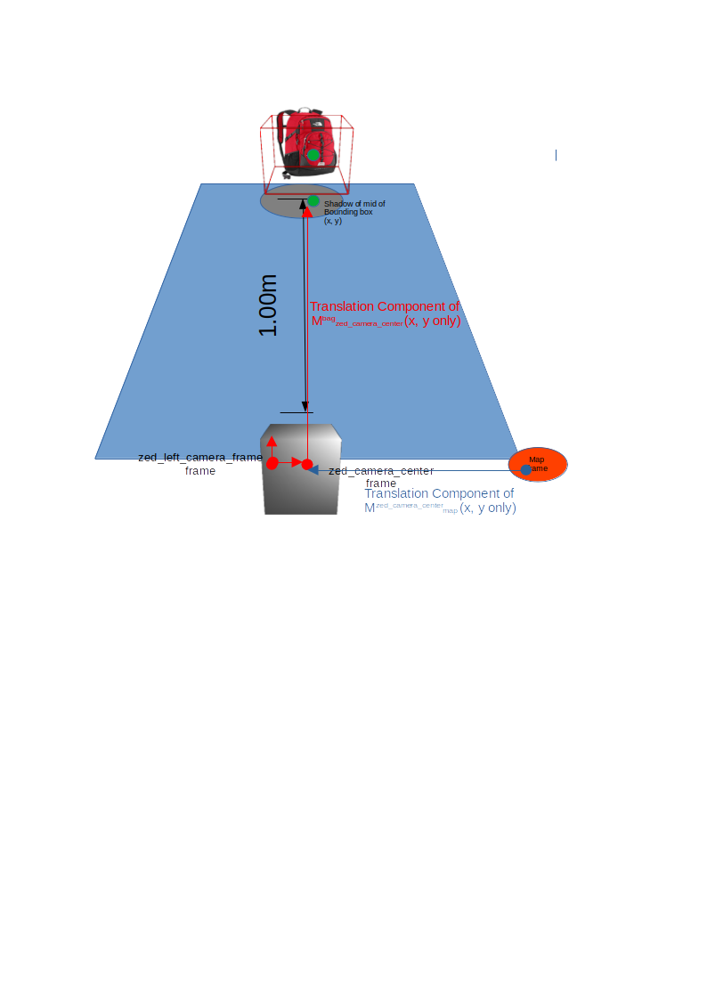

# HW4 Part 2 - Drive to Bag and stop within 1.0m

This assumes the `ros_ws` from the earlier practical is already built.

1. Make new package: `ros2 pkg create --build-type ament_python object_follower_hw`

2. Put python file with the Node implementation into new package

3. Colcon build the new package: `colon build --symlink-install --packages-select object_follower_hw`
    - Recommendation: Avoid building all packages, as it may include extra things already built - Zed2 takes quite long to do so.

4. Source the workspace overlay: `source ~/ros_ws/install/local_setup.bash`

5. Start remote control of RC Car
    - open terminal: `remote_control`
    - press reset button of arduino zero board
    - Option 1:
        - open new terminal:`ros2 run joy joy_node`
        - open new terminal type: `ros2 run car_control car_control`

    - Option 2:
        - Run this command in terminal: `ros2 launch car_control car_control.launch.py`
  
6. For bounding box visualizer just use the one given in the practical and start rviz. Change the `common.yaml` file in the Zed2 package to use the bag classification model. In new terminals for each command:
    - Start the Zed2 camera: `ros2 launch zed_wrapper zed_camera.launch.py camera_model:=zed2`
    - Start the given visualizer for bounding boxes: `ros2 run obj_det_visualizer obj_visualizer`
    - Start RViz2, you should see a camera view and world view with marker representing the 3D bounding box from Zed2 object detection: `rviz2`

7. Start the node to control the car: `ros2 run object_follower_hw straight_follower`
    - Make sure the car is in autonomous mode by pressing the joycon

The normal version of the node (`object_follower.py`) runs this logic in a nutshell, it only moves straight via bang bang control of linear x velocity:

# HW4 Question 2 Bonus - Chase Objects

There's a second version of the node (`object_follower_enhanced.py`) which can be launched via `ros2 run object_follower_hw chase_follower`. This version has the added benefits of
    - Actually being able to turn (as it also calculates angular velocity)
    - Proportional controller for both linear and angular velocity, this allows it to not overshoot as much as the first version
    - Downside: The poor odometry of visual odom makes it impossible to run more than a few metres (it gets thrown off when it brakes), but it does give chase during that time
